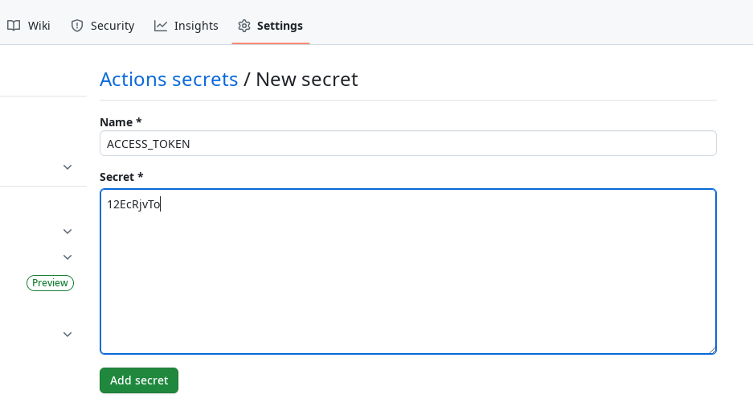

page-title: How to create a page
---

This page explains how you can get a conference page hosted on mathconf.eu.
The process is intended to be technologically simple and stable. After the
initial setup of your page, it should allow you to publish updates to the
webpage simply by pushing a new commit to GitHub.

The way mathconf.eu works is:
* A conference is identified by its **page key** which is a string like
  `gcc-uit-2025`. This is the subdirectory in which the conference pages
  live, e.g., <https://mathconf.eu/gcc-uit-2025>.
* The server associates an **access token** with each page key.
  Anyone with the access token can publish updates to the conference page
  by sending an archive with HTML, CSS, etc. files to the server. This
  archive is unpacked and published verbatim.

*Note on processing data*: We only serve *static websites*. There is **no**
Perl, PHP, Node.js etc. running on the server and so you cannot serve dynamic
websites. You also cannot accept or process user input through HTML forms.
If you want to run, e.g., a registration form, you have to set this up on
another web service like [Nettskjema](https://nettskjema.no) which makes an
effort to comply with the privacy and security regulations for handling
such data.

## Get an access token

To reserve a page key and get an access token for it, you should contact
[Tobias Boege](mailto:tobias.a.boege@uit.no) by email. Currently this has
to be done manually and is based on trust that you will not abuse this
service.

## Creating your website

Once you are entrusted with an access token, you can publish anything inside
your page directory on mathconf.eu by simply sending a bunch of files to the
server. This gives you a great deal of flexibility in how to author your
website. You can write your website in HTML from scratch or use one of the
many [static site generators](https://github.com/myles/awesome-static-generators)
out there, such as Hugo or Jekyll.

Now is a good time to have a look at the [source code repository](https://github.com/mathconf-eu/howto)
of this tutorial page. It is written using the extremely simple [zs](https://git.mills.io/prologic/zs)
static site generator. I wrote a simple HTML template and CSS style which you
can see on this very website. To get your page up and running quickly, we are
going to reuse this template and just change the contents in critical places.

Step 1 is to fork the repository. Once you have your own fork at `user/howto`
you will want to rename it to something more appropriate like `user/myconf`.
Make a local copy to modify it:

``` console
$ git clone https://github.com/user/myconf && cd myconf
```

You will find that this tutorial is written up in the `index.md` file. There
is a CSS file for styling and there is a subdirectory `.zs` to control the
operation of the `zs` program. In it there are some configuration files and
the HTML template. All in all, there is not much. Look at all the files and
make changes as necessary to describe your conference or event.

To build and preview your website, you need the `zs` program.
See [its README](https://git.mills.io/prologic/zs) for installation
instructions. At the time of writing, this can be done by

``` console
$ go install go.mills.io/zs@latest
```

This will install the program into `$HOME/go/bin` if you don't have anything
specific set up. You may have to add this to your shell's `$PATH`. Afterwards,
you can build your website and look at it locally:

``` console
$ zs build  # files are written to .pub
$ zs serve
INFO[0000] zs 0.0.0@HEAD server listening on :8000
```

Open your web browser and point to to `localhost:8000` to view your page.

## Publishing

When you are satisfied with your page, run `zs build` to get the final product
assembled in the `.pub` directory. Then tar it up like so:

``` console
$ zs build
$ tar -zcvf myconf.tar.gz -C .pub .
```

It is important that this archive is "flat": it should directly contain all
files and subdirectories in `.pub` but it should not contain the `.pub`
directory itself. Next we upload it to the server using our access token:

``` console
$ export PAGE_KEY=myconf         # your page key goes here
$ export ACCESS_TOKEN=12EcRjvTo  # your access token goes here
$ curl -F "token=$ACCESS_TOKEN" -F "archive=@myconf.tar.gz" "https://mathconf.eu/publish/$PAGE_KEY"
Successfully updated myconf!
```

This process can be automated using GitHub Actions. If you forked the
repository of this tutorial, you will already have a GitHub action set
up which will publish your page on every commit that you push to the
repository. It only requires two *repository secrets* to be operational:
the page key and the access token.

In your repository "Settings" under "Secrets and Variables" you have to
create the secrets `PAGE_KEY` and `ACCESS_TOKEN` with the values you get
by email upon registration. They will be similar to the ones shown in
the terminal session above. GitHub will keep these values secret but make
them available to scripts running as Actions on behalf of you, e.g., when
you push a commit.


